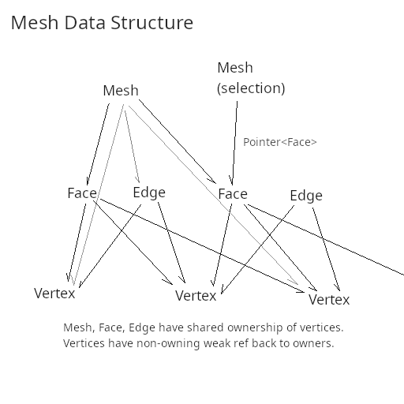

# Mesh Test

<p align="center">
  
</p>

## Install 
If you don't have rust, please follow the instructions here: 
https://www.rust-lang.org/learn/get-started
[Rust Analyzer](https://rust-analyzer.github.io/) in VS code or other editor is great for understanding the code.

## Docs
To build and view the docs run ```cargo doc --open```. It should open a browser and allow you to traverse the crate. 

## Test
You need to change constants in ```src/config.rs``` to have absolute path to ```src/test_data``` and ```src/test_output```
```cd``` into root folder and run ```cargo test``` 
```cargo test``` will build and run the tests if you are in the root of the project (one up from src).
Note that the `HashSet`s start with random state so the tests are different each time. This is probably not good for testing
but I didn't fix it yet.

## Discussion 
Discuss the reasons you used the data structure design you did:
This is Take-2 for the challenge. I completely changed the data structure to be a smart pointer graph. The main advantage is that selection, insertion, and deletion all become more simple, especially deletion compared to the previous flat array. There are Vertex, Face, and Edge structures which help break out logic into smaller parts. It should be easier to read and maintain. It is more reliable because parts are not accessed via indices, their connections are made in a few critical places such as importing or creating a new face. I can traverse the surface of the mesh easily because the vertices have backward weak pointers to their owners. Multiple Mesh, Face, and Edge can own vertices. If a vertex is deleted in a mesh, it is not lost until everything else also "deletes" it. 

Discuss what kinds of geometry and/or quality checks you would add to 5 and 6 if you had time, to ensure that the resulting mesh had
good quality.
I would use the consistent orientation method and ensure there are no open edges with logic already built for counting surface mesh bounding loops. I would also need to ensure there are no intersections with non-adjacent faces which is a harder problem. I would need to take the faces as parametric functions and solve for possible bad intersections. 

I got something almost working for number 5 but it doesn't look right.


